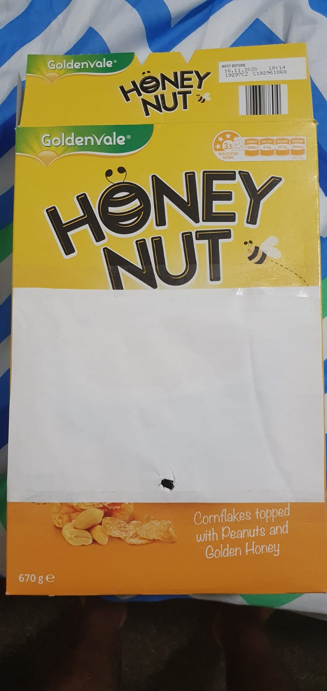

# Assessment 1: Replication project

*Fill out the following workbook with information relevant to your project.*

*Markdown reference:* [https://guides.github.com/features/mastering-markdown/](http://guides.github.com/features/mastering-markdown/)

## Temperature Gauge with Report ##

## Related projects ##
*Find about 6 related projects to the project you choose. A project might be related through  function, technology, materials, fabrication, concept, or code. Don't forget to place an image of the related project in the* `replicationproject` *folder and insert the filename in the appropriate places below. Copy the markdown block of code below for each project you are showing, updating the number* `1` *in the subtitle for each.*

### Related project 1 ###
Temperature Gauge

https://www.hackster.io/anish78/how-to-create-temperature-gauge-using-micro-bit-a601cc

This project is related to mine because it has heavily inspired my project, and the code base used is very similar. Both the projects make use of Micro:bit and are coded using the website makecode.microbit.org. Both the projects also make use of Servo motors and the in-built microbit temperature sensor.

### Related project 2 ###
Show String

https://makecode.microbit.org/reference/basic/show-string

This project is related to mine because showing a string value for a certain range of temperature is part of my project as well.

### Related project 3 ###
Using The BBC micro:bit To Control A Servo

https://www.kitronik.co.uk/blog/using-bbc-microbit-control-servo/

This project is related to mine because it involves the testing of my servo motor. Although the code base I used to test my servo motor was slightly different, this project gave me an idea to test the rotation capabilities of the servo motor

### Related project 4 ###
Micro:bit - Heat activated Fan

https://www.youtube.com/watch?v=iilfeimMDjM

This project is related to mine because for this project I tried to using the fan and was successful in coding the control of it with respect to temperature. Increase in temperature would lead to increase in speed of the fan. Due to lack of available resources and power supplied by micro:bit, both the fan and servo motor could not be implemented together.

## Reading reflections ##
*Reflective reading is an important part of actually making your reading worthwhile. Don't just read the words to understand what they say: read to see how the ideas in the text fit with and potentially change your existing knowledge and maybe even conceptual frameworks. We assume you can basically figure out what the readings mean, but the more important process is to understand how that changes what you think, particularly in the context of your project.*

*For each of the assigned readings, answer the questions below.*

### Reading: Don Norman, The Design of Everyday Things, Chapter 1 (The Psychopathology of Everyday Things) ###

*What I thought before: Describe something that you thought or believed before you read the source that was challenged by the reading.*

*What I learned: Describe what you now know or believe as a result of the reading. Don't just describe the reading: write about what changed in YOUR knowledge.*

*What I would like to know more about: Describe or write a question about something that you would be interested in knowing more about.*

*How this relates to the project I am working on: Describe the connection between the ideas in the reading and one of your current projects or how ideas in the reading could be used to improve your project.*

### Reading: Chapter 1 of Dan Saffer, Microinteractions: Designing with Details, Chapter 1 ###

*What I thought before: Describe something that you thought or believed before you read the source that was challenged by the reading.*

*What I learned: Describe what you now know or believe as a result of the reading. Don't just describe the reading: write about what changed in YOUR knowledge.*

*What I would like to know more about: Describe or write a question about something that you would be interested in knowing more about.*

*How this relates to the project I am working on: Describe the connection between the ideas in the reading and one of your current projects or how ideas in the reading could be used to improve your project.*

### Reading: Scott Sullivan, Prototyping Interactive Objects ###

*What I thought before: Describe something that you thought or believed before you read the source that was challenged by the reading.*

*What I learned: Describe what you now know or believe as a result of the reading. Don't just describe the reading: write about what changed in YOUR knowledge.*

*What I would like to know more about: Describe or write a question about something that you would be interested in knowing more about.*

*How this relates to the project I am working on: Describe the connection between the ideas in the reading and one of your current projects or how ideas in the reading could be used to improve your project.*

## Interaction flowchart ##
*Draw a flowchart of the interaction process in your project. Make sure you think about all the stages of interaction step-by-step. Also make sure that you consider actions a user might take that aren't what you intend in an ideal use case. Insert an image of it below. It might just be a photo of a hand-drawn sketch, not a carefully drawn digital diagram. It just needs to be legible.*

## Process documentation ##

I started the project with an initial servo motor test by connecting the microbit pins P0, 3V and GND to the the servo motor as shown in the fig below.

Once the connections were done, I went to https://makecode.microbit.org/ and started a new project and created the following code as shown in the picture below. Later, I downloaded the code into the microbit and tested the rotation.

Now with the same connections and a successful run of the previous test, I built another code as shown in the figure below. Later I downloaded the code and implemented it in the micro:bit. This code was used to mark the temperature readings to make a gauge scale.

I used a cardboard box and stuck a white sheet on it, made a hole so that the servo motor could be attached.

I attached the servo motor in that hole and with the micro:bit coded to show temperature, I marked the readings on the white sheet of paper. I controlled the temperature by using a hair dryer.

I later decorated the box a bit more and gave empahsis on the readings as well.

After this, I tried to include a fan by connecting the input P2 to the positive end and GND to negative end of the fan. Afterwards I coded the following code to control the speed of the fan with temperature in such a manner that as temperature increases, fan speed increases.

The code worked perfectly as when the risen temperature started to drop, so did the fan speed as well. But what laid motionless was the servo motor.

## Project outcome ##

*Complete the following information.*

### Project title ###

### Project description ###

*In a few sentences, describe what the project is and does, who it is for, and a typical use case.*

### Showcase image ###

*Try to capture the image as if it were in a portfolio, sales material, or project proposal. The project isn't likely to be something that finished, but practice making images that capture the project in that style.*

### Additional view ###

*Provide some other image that gives a viewer a different perspective on the project such as more about how it functions, the project in use, or something else.*

### Reflection ###

*Describe the parts of your project you felt were most successful and the parts that could have done with improvement, whether in terms of outcome, process, or understanding.*

*What techniques, approaches, skills, or information did you find useful from other sources (such as the related projects you identified earlier)?*

*What ideas have you read, heard, or seen that informed your thinking on this project? (Provide references.)*

*What might be an interesting extension of this project? In what other contexts might this project be used?*
