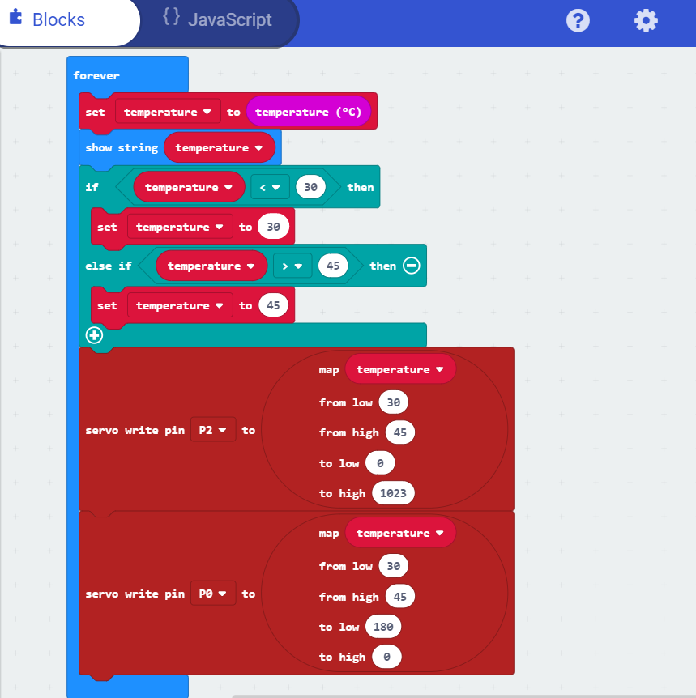

# Assessment 1: Replication project

## Weather Report ##

## Related projects ##

### Related project 1 ###
Temperature Gauge

https://www.hackster.io/anish78/how-to-create-temperature-gauge-using-micro-bit-a601cc

This project is related to mine because it has heavily inspired my project, and the code base used is very similar. Both the projects make use of Micro:bit and are coded using the website makecode.microbit.org. Both the projects also make use of Servo motors and the in-built microbit temperature sensor.

### Related project 2 ###
Show String

https://makecode.microbit.org/reference/basic/show-string

This project is related to mine because showing a string value for a certain range of temperature is part of my project as well.

### Related project 3 ###
Using The BBC micro:bit To Control A Servo

https://www.kitronik.co.uk/blog/using-bbc-microbit-control-servo/

This project is related to mine because it involves the testing of my servo motor. Although the code base I used to test my servo motor was slightly different, this project gave me an idea to test the rotation capabilities of the servo motor

### Related project 4 ###
Micro:bit - Heat activated Fan

https://www.youtube.com/watch?v=iilfeimMDjM

This project is related to mine because for this project I tried to using the fan and was successful in coding the control of it with respect to temperature. Increase in temperature would lead to increase in speed of the fan. Due to lack of available resources and power supplied by micro:bit, both the fan and servo motor could not be implemented together.

## Reading reflections ##

### Reading: Don Norman, The Design of Everyday Things, Chapter 1 (The Psychopathology of Everyday Things) ###

What I thought before: I thought this would talk about design of technical interactive objects. There is not much thinking that would go into design when it comes to simple objects. Underestimated the concept of design thinking.

What I learned: 

*What I would like to know more about: Describe or write a question about something that you would be interested in knowing more about.*

*How this relates to the project I am working on: Describe the connection between the ideas in the reading and one of your current projects or how ideas in the reading could be used to improve your project.*

### Reading: Chapter 1 of Dan Saffer, Microinteractions: Designing with Details, Chapter 1 ###

What I thought before: Never understood microinteractions so I had very little of knowledge of it. I thought they were just additional gimmicks that made a product look more fancy.

What I learned: The concept of microinteractions and what exactly they are. Although we do not tend to emphasize the importance of microinteractions, they have a major impact when it comes to interaction. They also explain some certain cases where microinteractions are not features yet they become features of some daily products.

What I would like to know more about: The future of microinteractions and it's what makes it so impactful - Design or Function?.

How this relates to the project I am working on: I have also included a microinteraction in my project which is the "Weather Report" for each and every temperature detected. 

### Reading: Scott Sullivan, Prototyping Interactive Objects ###

What I thought before: Before reading this document I presumed that designers do not have to learn coding. Also I never presumed that one could sketch with code. Also I presumed that one must already possess the skills while building a project whereas it is not true.

What I learned: Well first thing is that design is really important. His device seemed like a bomb for many customers as they entered the store intimidating the customers. Secondly, I also understood that if curiosity is instilled among designers, one can acheive how to make the device no matter the time spent. Since I had experience with Ardiuno, I never realised that along with Processing one could use it in the field of Augmented Reality. Also, not every project initially is created perfect. Only by making mistakes and learning from those mistakes, one can almost reach perfection, but never perfection as evrything can be made better than before. Innovation never ends. 

What I would like to know more about: Is the author still publishing his project papers as the way he goes through some of them are really interesting? Also is he currently working on new projects as well?

How this relates to the project I am working on: Well towards the end, he also encountered a dead-end he couldn't avoid and had to abandon a certain part of his project like I did with the fan. However, I felt the same as I wanted to do more with the project just like him and explore certain possibilities with technology like him. He also ventured in this project, head on, as an amateur.

## Interaction flowchart ##
*Draw a flowchart of the interaction process in your project. Make sure you think about all the stages of interaction step-by-step. Also make sure that you consider actions a user might take that aren't what you intend in an ideal use case. Insert an image of it below. It might just be a photo of a hand-drawn sketch, not a carefully drawn digital diagram. It just needs to be legible.*

## Process documentation ##

I started the project with an initial servo motor test by connecting the microbit pins P0, 3V and GND to the the servo motor as shown in the fig below.

Once the connections were done, I went to https://makecode.microbit.org/ and started a new project and created the following code as shown in the picture below. Later, I downloaded the code into the microbit and tested the rotation.

Now with the same connections and a successful run of the previous test, I built another code as shown in the figure below. Later I downloaded the code and implemented it in the micro:bit. This code was used to mark the temperature readings to make a gauge scale.

I used a cardboard box and stuck a white sheet on it, made a hole so that the servo motor could be attached.

I attached the servo motor in that hole and with the micro:bit coded to show temperature, I marked the readings on the white sheet of paper. I controlled the temperature by using a hair dryer.

I later decorated the box a bit more and gave empahsis on the readings as well.

After this, I tried to include a fan by connecting the input P2 to the positive end and GND to negative end of the fan. Afterwards I coded the following code to control the speed of the fan with temperature in such a manner that as temperature increases, fan speed increases.

The code worked perfectly as when the risen temperature started to drop, so did the fan speed as well. But what laid motionless was the servo motor probably due to insufficient power input.

Due to lack of resources available to fix the problem and avoiding to venture outside to look for these resources due to the recent Covid-19 outbreak, I decided to leave the fan aside and move on with the temperature gauge. With the same connections intact, I built the following code for "Weather Report" as shown in the image below.

As for the solution to bring power into the micro:bit, go to this link:

## Project outcome ##

The project worked as expected. With the help of my friend, who was handling the hair dryer to increase the temperature, and me recording the video, the invention took the readings accordingly and gave string output for each temperature range. Although when the temperature was beyond 45 C, the pointer started vibrating, indicating "Danger" on the micro:bit screen was unintentional but it did give a dramatic flair. As the temperature dropped gradually, it gave out other "Reports" for the following temperature ranges.

1) Between 45 C and 40 C - Hot
2) Between 40 C and 35 C - Moderate
3) Between 35 C and 30 C - Cool
4) Beneath 30 C          - Chill
5) Beyond 45 C           - Danger

Refer the video for the recorded experiment outcome. Refer the youtube link: 
https://www.youtube.com/watch?v=-lQDBV0vSfQ

### Weather Report ###

### Project description ###

This is a mini prototype of what could be a weather box with capabilities of either cooling or heating the space on the basis of environment temperature ( with fan and heater attached). With an external thermal detector, an advanced version of this project can be used in hospitals to give temperature readings of patients and at the same time give a response back to the patients about their temperature without the presence of a doctor around. This could also be used in pandemic situations when doctors get really busy with other patients. This could also be used at home by children to understand the changes of temperature.

### Showcase image ###

### Additional view ###

### Reflection ###

The first thing I understood while building this project was to consider the factor of power input for each and every component that would be connected. The coding aspect of this project is really interesting as I came to know about the use of additional code blocks that can be used. Coding on a micro:bit is interactive and easy as it also allows you to simulate the results of the code that is built. 

I could have improved this project if I had an external temperature detector which could measure the temperature of a solid and liquid object. Also by adding an external power supply to the servo motor, I could have also added a fan that increases speed with respect to the temperature. With a speaker, a little bit of extra coding, and time, I could implement a virtual assistant that would read the "Weather Report" out loud. This could help blind people to also interact with my project as well.

The fan implementation was not a complete success as I got the code working. But just coding is not the main aspect to building anything, engineers should be capable of iterating out their code in the open world. To make interactive projects, one must reach culmination of coding, building and design, which is only possible by engaging and practicing with other interactive designers as well.

That conludes my understanding by working on this project. References that I have used for this project are basically the related projects I have mentioned but please check the list below.

